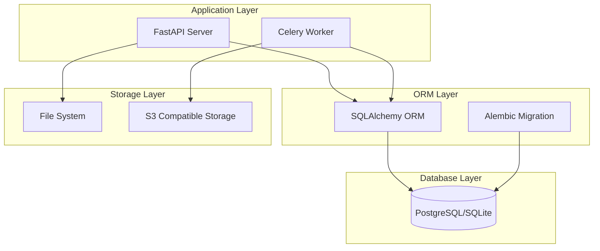

# Nong-View 데이터베이스 아키텍처

**문서 버전**: 1.0.0  
**작성일**: 2025-10-27  
**작성자**: Development Team

---

## 1. 개요

Nong-View 시스템의 데이터베이스는 드론 정사영상 분석 결과를 체계적으로 저장하고 관리하기 위한 관계형 데이터베이스 구조입니다.

## 2. 아키텍처 다이어그램



## 3. 데이터베이스 스키마

### 3.1 Entity Relationship Diagram

```
┌─────────────┐      ┌─────────────┐      ┌─────────────┐
│   Images    │──┐   │  Analyses   │──┐   │   Results   │
└─────────────┘  │   └─────────────┘  │   └─────────────┘
                 │                     │
                 ├──────────┬──────────┘
                 │          │
┌─────────────┐  │   ┌─────────────┐      ┌─────────────┐
│    Tiles    │──┘   │ TileResults │      │   Parcels   │
└─────────────┘      └─────────────┘      └─────────────┘
                                                  │
                                          ┌─────────────┐
                                          │ParcelStats  │
                                          └─────────────┘
```

### 3.2 테이블 관계

- **1:N 관계**
  - Image → Analyses (하나의 이미지에 여러 분석)
  - Image → Tiles (하나의 이미지를 여러 타일로 분할)
  - Analysis → Results (하나의 분석에 여러 결과)
  - Parcel → ParcelStatistics (하나의 필지에 여러 통계)

- **N:N 관계** (Junction Table)
  - Tiles ↔ Analyses (via TileResults)

## 4. 데이터 모델 설계 원칙

### 4.1 Primary Key 전략
- **UUID 사용**: 모든 테이블의 PK는 UUID v4 사용
- **장점**: 
  - 분산 환경에서 충돌 방지
  - 예측 불가능한 ID로 보안 강화
  - 데이터 마이그레이션 용이

### 4.2 시간 관리
- **created_at**: 레코드 생성 시간 (자동)
- **updated_at**: 레코드 수정 시간 (자동)
- **started_at/completed_at**: 작업 시작/완료 시간

### 4.3 JSON 필드 활용
```python
# 유연한 데이터 저장을 위한 JSON 필드
metadata = Column(JSON)      # 이미지 메타데이터
parameters = Column(JSON)     # 분석 파라미터
geometry = Column(JSON)       # GeoJSON 형태의 공간 데이터
bounds = Column(JSON)         # 경계 좌표
attributes = Column(JSON)     # 추가 속성
```

### 4.4 상태 관리
```python
# 표준화된 상태 값
IMAGE_STATUS = ['uploaded', 'processing', 'completed', 'failed']
ANALYSIS_STATUS = ['pending', 'running', 'completed', 'failed']
EXPORT_STATUS = ['pending', 'processing', 'completed', 'failed']
```

## 5. 성능 최적화 전략

### 5.1 인덱스 설계
```sql
-- 자주 조회되는 필드에 인덱스 추가
CREATE INDEX idx_images_status ON images(status);
CREATE INDEX idx_analyses_job_id ON analyses(job_id);
CREATE INDEX idx_parcels_pnu ON parcels(pnu);
CREATE INDEX idx_tiles_image_id ON tiles(image_id);
```

### 5.2 파티셔닝 전략
- **시간 기반 파티셔닝**: Results 테이블을 월별로 파티셔닝
- **공간 기반 파티셔닝**: Parcels를 지역별로 파티셔닝

### 5.3 연결 풀링
```python
# PostgreSQL 연결 풀 설정
engine = create_engine(
    DATABASE_URL,
    pool_size=20,        # 기본 연결 수
    max_overflow=40,     # 최대 추가 연결
    pool_pre_ping=True,  # 연결 상태 체크
    pool_recycle=3600    # 1시간마다 연결 재활용
)
```

## 6. 데이터 무결성

### 6.1 Foreign Key Constraints
```python
# CASCADE 옵션으로 참조 무결성 보장
image_id = Column(String, ForeignKey("images.id", ondelete="CASCADE"))
```

### 6.2 Unique Constraints
```python
# 중복 방지를 위한 유니크 제약
pnu = Column(String, unique=True, nullable=False)
job_id = Column(String, unique=True)
filepath = Column(String, unique=True)
```

### 6.3 Check Constraints
```sql
-- 값 범위 제한
ALTER TABLE analyses ADD CONSTRAINT check_progress 
  CHECK (progress >= 0 AND progress <= 100);

ALTER TABLE results ADD CONSTRAINT check_confidence 
  CHECK (confidence >= 0 AND confidence <= 1);
```

## 7. 보안 고려사항

### 7.1 개인정보 보호
- **암호화**: owner_name 등 민감 정보는 암호화 저장
- **마스킹**: API 응답 시 개인정보 마스킹 처리
- **접근 제어**: Role-based Access Control 구현

### 7.2 SQL Injection 방지
- **ORM 사용**: SQLAlchemy ORM으로 쿼리 파라미터화
- **입력 검증**: Pydantic 스키마로 입력값 검증

## 8. 백업 및 복구 전략

### 8.1 백업 정책
- **전체 백업**: 주 1회 (일요일 02:00)
- **증분 백업**: 일 1회 (매일 02:00)
- **트랜잭션 로그**: 실시간 백업

### 8.2 복구 시나리오
1. **Point-in-Time Recovery**: 특정 시점으로 복구
2. **Disaster Recovery**: 전체 시스템 복구
3. **Partial Recovery**: 특정 테이블만 복구

## 9. 모니터링 지표

### 9.1 성능 지표
- Query Response Time
- Connection Pool Usage
- Table/Index Size
- Cache Hit Ratio

### 9.2 운영 지표
- Active Connections
- Transaction Rate
- Error Rate
- Storage Usage

## 10. 확장성 고려사항

### 10.1 수평 확장
- **읽기 복제본**: Read replica로 읽기 부하 분산
- **샤딩**: 필지 PNU 기반 데이터 샤딩

### 10.2 수직 확장
- **리소스 확장**: CPU, Memory, Storage 증설
- **성능 튜닝**: Query 최적화, 인덱스 조정

## 11. 마이그레이션 전략

### 11.1 Alembic 사용
```bash
# 마이그레이션 생성
alembic revision --autogenerate -m "Add new column"

# 마이그레이션 적용
alembic upgrade head

# 롤백
alembic downgrade -1
```

### 11.2 Zero-downtime Migration
1. 새 컬럼 추가 (nullable=True)
2. 데이터 마이그레이션
3. NOT NULL 제약 추가
4. 이전 컬럼 제거

## 12. 데이터베이스 선택 가이드

### 12.1 개발 환경
- **SQLite**: 간단한 로컬 테스트
- **PostgreSQL**: 프로덕션 유사 환경

### 12.2 운영 환경
- **PostgreSQL**: 메인 데이터베이스
- **PostGIS**: 공간 데이터 처리
- **TimescaleDB**: 시계열 데이터 처리

---

**문서 관리**
- 최종 수정일: 2025-10-27
- 다음 리뷰: 2025-11-03
- 담당자: Database Team